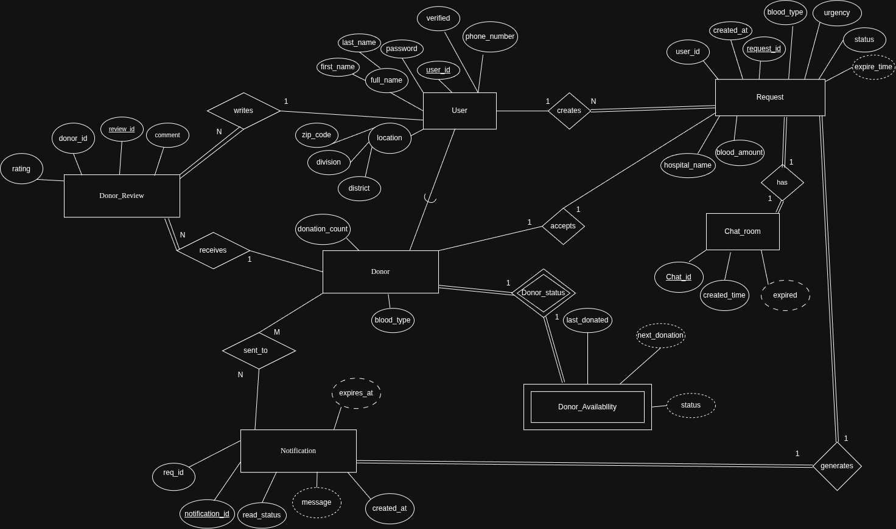
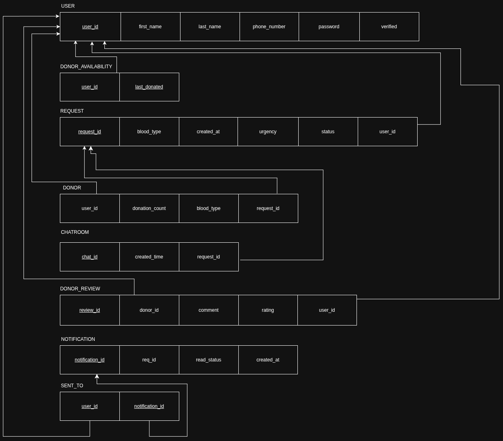

# RoktoConnect

RoktoConnect is a blood request and donor coordination platform. Requesters post blood requests with type, urgency, and location. Donors in the same division are notified, accept requests, and coordinate with the requester over per-request live chat. Completed donations are rated and feed into a donor leaderboard.


## How it works

There are two roles. A user is always a requester; a user becomes a donor once via `POST /donors/become`. A donor can also request blood.

Request lifecycle:

1. **Create (`PENDING`).** Requester creates one active request (blood type, urgency `low|medium|high|critical`, message max 500 chars, zip/division/district defaulting to profile). Server creates a `CHATROOM` row, emits a feed event to the division room, and creates one `NOTIFICATION` + `SENT_TO` row per available donor in that division.
2. **Accept (`PENDING` -> `DONOR_FOUND`).** A donor with no active engagement accepts. `DONOR.request_id` is set to the request. Both sides get access to `GET /requests/{id}/chat` and the chat WebSocket. Requester is notified.
3. **Coordinate.** Requester and donor use the per-request chat room (presence count, message history, partner profile with rating/donation stats).
4. **Release or complete.**
   - Release (`DONOR_FOUND` -> `PENDING`): owner or linked donor unlinks via `DELETE /requests/{id}/donor`. The request becomes acceptable again.
   - Complete: owner submits rating 1-5 plus optional comment via `POST /requests/{id}/complete`. Server inserts `DONOR_REVIEW`, increments `DONOR.donation_count`, and deletes the `REQUEST` row (cascades to chatroom/notifications; donor row is unlinked first so the donor record survives).

A user can hold one active request at a time (409 on duplicate). A donor can engage with one request at a time.

## Core functionality

### Auth and profile

- Register with `first_name, last_name, phone_number, zip_code, division, district, password`. Phone must be unique. Returns a JWT immediately (auto-login).
- Login with phone + password. Token is JWT HS256, 7-day expiry, sent as `Authorization: Bearer <token>` on REST and `?token=` on WebSockets.
- `GET /me` returns profile plus derived donor state: `is_donor, donor_blood_type, donation_count, accepted_request_id`.
- `PATCH /users/me` edits `first_name, last_name, zip_code, district, division` only. Phone number is immutable. `POST /users/me/password` verifies current password before updating. `POST /logout` is a stateless stub; client clears the persisted token and query cache.

Client: Zustand `useAuthStore` persisted to localStorage, Axios attaches the token and clears it on 401, TanStack Query caches `['users','me']` with 5-minute stale time. `ProtectedLayout` gates `/dashboard, /leaderboard, /profile, /donor/requests, /chat/:requestId, /notifications` on `GET /me`.

### Requests

- `POST /requests`: validated by `CreateRequestSchema` (8 blood types, urgency normalized to upper case). Location fields fall back to the user's profile.
- `GET /requests?limit=`: division-filtered feed for the caller, `PENDING` first, same-district first. Default limit 10, max 50.
- `GET /requests/mine`: caller's requests with joined chat, donor, and rating info. Powers `MyRequestsSection` (edit, remove donor, mark completed with review, delete with two-click confirm).
- `PATCH /requests/{id}`: owner-only, edits blood type / urgency / message. Location is locked after creation. Rejected if already completed.
- `DELETE /requests/{id}`: owner-only. Unlinks `DONOR.request_id` first, then deletes so the donor record is not cascade-deleted.

Client: `Dashboard` shows feed count plus critical/urgent stats, recent feed cards, and `MyRequestsSection`. `CreateRequestModal` / `EditRequestModal` use react-hook-form + Zod.

### Donor matching

- `POST /donors/become {blood_type}`: one-time opt-in. 409 if already a donor.
- `DonorRequests` page (`GET /requests` filtered by caller's location): shows acceptable requests, hides own requests, blocks accept when the donor already has `accepted_request_id`, shows `DONOR_FOUND` badge and chat link otherwise.
- `POST /requests/{id}/accept`: donor-only. Guards against accepting own request, non-`PENDING` status, and double engagement.
- `DELETE /requests/{id}/donor`: release by owner or linked donor, resets status to `PENDING`.

### Chat

- `GET /requests/{id}/chat`: allowed for requester or linked donor only. Returns messages plus the other party's profile, donation count, average rating, and reviews.
- `WS /ws/requests/{id}/chat`: room broadcast, presence (`online_count`), 1000-character cap. Close codes `4401` (auth failed), `1011` (db error), `1008` (not a participant).
- Client `Chat.tsx` (`/chat/:requestId`) shows request context bar, presence label, message bubbles, clickable donor profile popover, and release action for donors.

### Notifications

- `GET /notifications` returns `{notifications[], unread_count}` ordered newest first, joined with request blood type/division/district for deep-linking.
- `PATCH /notifications/{id}/read`, `POST /notifications/read-all`, `DELETE /notifications` (marks read, deletes caller's `SENT_TO` rows, garbage-collects orphaned `NOTIFICATION` rows).
- Client: `NotificationBell` (badge + dropdown, 30s poll fallback), `NotificationToast` (5.5s auto-dismiss on WS push), `Notifications` page with all/unread filter. New-request notifications link to `/donor/requests`; accepted notifications link to `/chat/:id`.

### Reviews and leaderboard

- `POST /requests/{id}/complete {rating 1-5, comment?}`: owner-only, inserts `DONOR_REVIEW`, increments count, deletes request.
- `GET /donors/leaderboard?sort=rating|donation_count&limit=`: aggregates average rating and review count per donor. Client `Leaderboard` page toggles sort.

## Realtime

Two WebSocket surfaces, both authenticated via `?token=`:

- `WS /ws/requests`: division feed plus user notifications. Server sends `request_created/updated/deleted` events for the caller's division and per-user notify payloads. 30s server ping. Client `useRequestFeedSocket` invalidates `['requests']` queries on feed events and shows toasts on notify events, with exponential backoff to 30s on disconnect.
- `WS /ws/requests/{id}/chat`: per-request room via `ChatManager`. Client `useChatSocket` handles message + presence events.

Sync HTTP handlers push to async WS rooms through a captured event loop (`notify_feed_event`, `notify_users` via `run_coroutine_threadsafe`).

## Data model

ER diagram:



Schema diagram:




Tables (`server/rokto-connect-server/schema.sql`, MySQL 8, `utf8mb4`, UTC timestamps):

| Table | Purpose | Key constraints |
|-------|---------|-----------------|
| `USERS` | Identity, phone + password hash, location (`division/district/zip_code`), `verified` | `user_id` PK |
| `DONOR` | Donor profile per user, engagement lock | `user_id` PK/FK -> `USERS` cascade; `request_id` UNIQUE NULL FK -> `REQUEST` cascade |
| `REQUEST` | Blood request, `status PENDING/DONOR_FOUND`, message max 500 | `request_id` PK; `user_id` FK -> `USERS` cascade |
| `CHATROOM` | One row per request, created at request time | `chat_id` PK; `request_id` FK -> `REQUEST` cascade |
| `DONOR_REVIEW` | Rating + comment from requester to donor | `review_id` PK; `donor_id`, `user_id` FK -> `USERS` cascade |
| `DONOR_AVAILABLITY` | Last-donated timestamps per donor | Composite PK `(last_donated, donor_id)`; FK -> `USERS` cascade |
| `NOTIFICATION` | Per-request notification object | `notification_id` PK; `request_id` FK -> `REQUEST` cascade |
| `SENT_TO` | Fan-out mapping of notification to recipient | Composite PK `(user_id, notification_id)`; FKs cascade |

Seed data (`seed.sql`) provides demo users, requests, a donor, chatroom, review, and notification rows.

## API reference

Base prefix: `/api/v1`. Auth: `Authorization: Bearer <token>` except WS which uses `?token=`.

| Resource | Method / Socket | Notes |
|----------|-----------------|-------|
| Auth | `POST /register` | Unique phone check, bcrypt hash, returns `access_token` |
| Auth | `POST /login` | Phone + password, returns `access_token` |
| Auth | `GET /me` | Profile + donor state |
| Auth | `PATCH /users/me` | Updatable: name, zip, district, division; phone immutable |
| Auth | `POST /users/me/password` | Requires current password |
| Auth | `POST /logout` | Stateless; client clears token |
| Requests | `POST /requests` | 409 if caller has active request; creates chatroom, feed event, donor fan-out |
| Requests | `GET /requests?limit=` | Division feed, PENDING first, same-district first; 10 default, 50 max |
| Requests | `GET /requests/mine` | Caller requests with chat/donor/rating joins |
| Requests | `PATCH /requests/{id}` | Owner-only; blood/urgency/message only |
| Requests | `DELETE /requests/{id}` | Owner-only; unlinks donor first |
| Requests | `POST /requests/{id}/accept` | Donor-only; atomic PENDING + idle-donor guards; notifies requester |
| Requests | `DELETE /requests/{id}/donor` | Owner or linked donor; resets to PENDING |
| Requests | `POST /requests/{id}/complete` | Owner-only; `{rating 1-5, comment?}`; writes review, increments count, deletes request |
| Donors | `POST /donors/become` | One-time; 409 if already donor |
| Donors | `GET /donors/leaderboard?sort=&limit=` | `sort=rating\|donation_count`, limit 1-50 |
| Chat | `GET /requests/{id}/chat` | Requester or linked donor only; messages + partner stats |
| Chat | `WS /ws/requests/{id}/chat` | Room broadcast + presence; 1000-char cap |
| Feed | `WS /ws/requests` | Division feed events + per-user notify; 30s ping |
| Notifications | `GET /notifications` | `{notifications[], unread_count}` newest first |
| Notifications | `PATCH /notifications/{id}/read` | 404 if not owned |
| Notifications | `POST /notifications/read-all` | Marks all owned unread as READ |
| Notifications | `DELETE /notifications` | Clears owned mappings, GCs orphans |

Validation (`app/schemas/`): phone regex, zip format, 8 blood types, urgency low/medium/high/critical, message max 500, comment max 255.

## Project structure

```
rokto-connect/
├── client/rokto-connect-client/
│   ├── components/      # Landing sections (outside src): NavBar, HowItWorks, BloodTypes, Features, CTABanner, StatsStrip
│   ├── src/
│   │   ├── App.tsx      # Routes: / (landing), /login, /register, ProtectedLayout -> /dashboard, /donor/requests, /chat/:requestId, /leaderboard, /profile, /notifications
│   │   ├── main.tsx     # BrowserRouter + QueryClientProvider
│   │   ├── pages/       # Login, Register, Dashboard, DonorRequests, Chat, Profile, Leaderboard, Notifications
│   │   ├── components/  # ProtectedLayout, Create/EditRequestModal, MyRequestsSection, ReviewModal, BecomeDonorModal, NotificationBell/Toast, ApiModal
│   │   ├── api/         # axios instance (VITE_API_URL + /api/v1) + auth, requests, donors, user, notifications
│   │   ├── stores/auth.ts  # Zustand persisted token
│   │   └── hooks/       # useCurrentUser, useChatSocket, useRequestFeedSocket
│   ├── endpoints.json   # local + primary URLs
│   └── vite.config.ts
├── server/rokto-connect-server/
│   ├── main.py          # FastAPI app, CORS, lifespan (init_db, capture_loop, close_db)
│   ├── app/api/v1/      # router, deps, auth, donors, requests (incl. WS), notifications
│   ├── app/core/        # db (thread-local MySQL + self-healing cursor), security (bcrypt/JWT), ws (ConnectionManager, ChatManager)
│   ├── app/schemas/     # auth, donors, requests validation
│   ├── schema.sql
│   └── seed.sql
├── docs/                # er-diagram.png, schema-diagram.png (to add)
└── palette.txt          # design tokens
```

